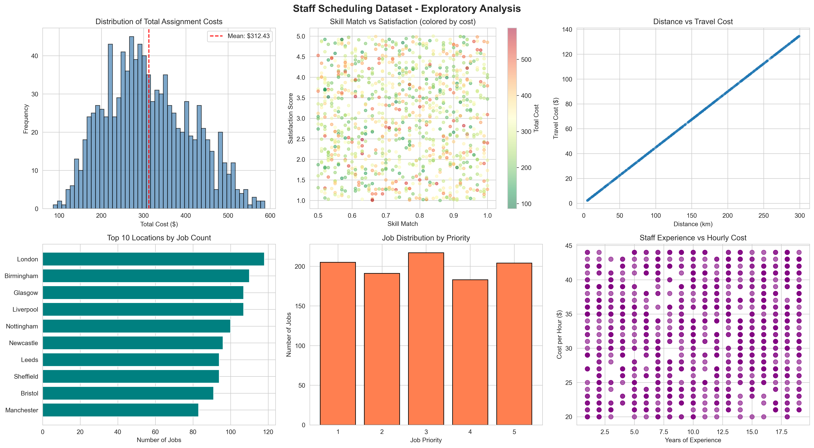
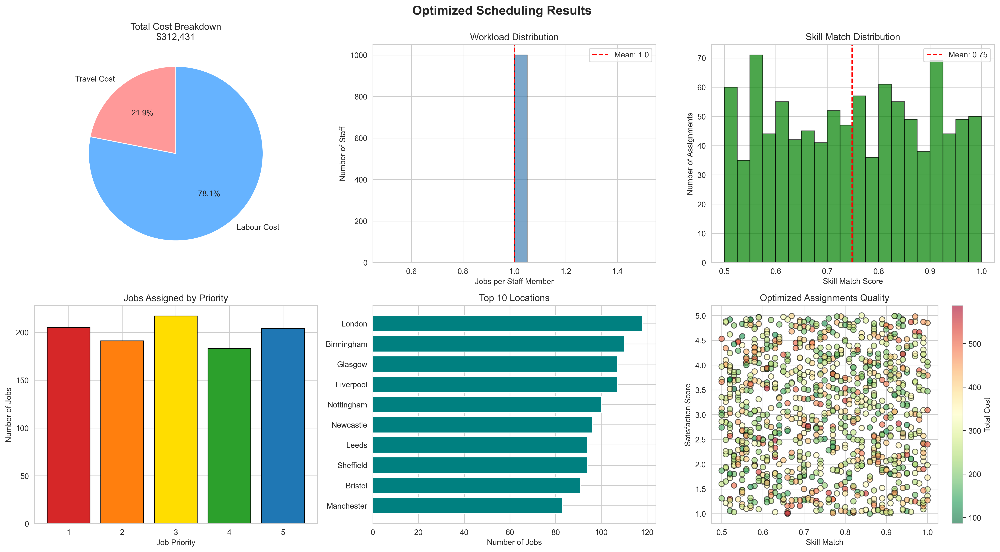

# Staff Scheduling Optimization System

A comprehensive Mixed Integer Linear Programming (MILP) solution for optimizing engineering staff assignments to jobs across the country.

## Overview

This system optimizes the assignment of engineering staff to jobs by considering multiple factors:
- **Cost Minimization**: Travel costs + labor costs
- **Staff Satisfaction**: Maximizing employee happiness
- **Skill Matching**: Ensuring the right skills for each job
- **Workload Balance**: Fair distribution of assignments

## Key Features

- **Multi-objective Optimization**: Balances competing priorities with configurable weights
- **Constraint Management**: Enforces business rules (skill requirements, workload limits, etc.)
- **Performance Analytics**: Comprehensive metrics and visualizations
- **Scalable Design**: Architecture ready for production deployment

## Project Structure

```
scheduling tool/
├── extended_staff_scheduling_dataset.csv  # Input data
├── scheduling_optimization.py             # Main optimization engine
├── optimized_schedule.csv                 # Output: Optimized schedule
├── eda_visualizations.png                 # Exploratory analysis charts
├── optimization_results.png               # Results visualizations
├── DEPLOYMENT_GUIDE.md                    # Deployment architecture
└── README.md                              # This file
```

## Quick Start

### Prerequisites

```bash
pip install pulp pandas numpy matplotlib seaborn
```

### Run the Optimization

```bash
python scheduling_optimization.py
```

### Expected Output

The script will:
1. Load and clean the dataset (1000 staff × 1000 jobs)
2. Perform exploratory data analysis
3. Build the MILP optimization model
4. Solve using CBC solver
5. Generate optimized schedule and performance metrics
6. Create visualizations

## Results Summary

### Performance Metrics

| Metric | Value |
|--------|-------|
| **Total Cost** | $312,430.85 |
| **Average Cost per Job** | $312.43 |
| **Average Satisfaction** | 3.01 / 5.00 |
| **Average Skill Match** | 74.8% |
| **Staff Utilized** | 1000 / 1000 |
| **Jobs Assigned** | 1000 |
| **Average Distance** | 152.1 km |

### Cost Breakdown

- **Travel Cost**: $68,441.85 (21.9%)
- **Labor Cost**: $243,989.00 (78.1%)

## Optimization Model Details

### Decision Variables

`x[i,j] = 1` if staff member `i` is assigned to job `j`, otherwise `0`

### Objective Function

```
Minimize:
  0.6 × (normalized_total_cost)
  - 0.2 × (normalized_satisfaction)
  - 0.2 × (skill_match_score)
```

### Constraints

1. **Job Assignment**: Each job assigned to exactly one staff member
2. **Skill Threshold**: Minimum 50% skill match required
3. **Workload Limit**: Maximum 5 jobs per staff member
4. **Binary Decision**: Assignment is either 0 or 1

### Model Characteristics

- **Type**: Mixed Integer Linear Program (MILP)
- **Variables**: 1,000,000 binary variables
- **Constraints**: 1,001,000 constraints
- **Solver**: CBC (COIN-OR Branch and Cut)
- **Solution Time**: ~12 seconds
- **Status**: Optimal solution found

## Dataset Schema

| Column | Description | Type |
|--------|-------------|------|
| Staff ID | Unique staff identifier | String |
| Years of Experience | Staff experience level | Integer |
| Absenteeism (Days) | Historical absenteeism | Integer |
| Satisfaction Score | Staff satisfaction (1-5) | Float |
| Job_ID | Unique job identifier | String |
| Job_Location | Job location city | String |
| Distance_km | Distance from staff to job | Float |
| Travel_Cost | Cost to travel | Float |
| Skill_Match | Skill match score (0-1) | Float |
| Job_Priority | Job priority (1-5) | Integer |
| Cost_per_Hour | Staff hourly rate | Float |
| Job_Hours | Hours required | Integer |
| Labour_Cost | Total labor cost | Float |
| Total_Cost | Travel + Labor cost | Float |

## Customization

### Modify Optimization Parameters

Edit the `build_optimization_model()` call in `scheduling_optimization.py`:

```python
optimizer.build_optimization_model(
    cost_weight=0.6,           # Weight for cost (0-1)
    satisfaction_weight=0.2,   # Weight for satisfaction (0-1)
    skill_weight=0.2,          # Weight for skill match (0-1)
    min_skill_match=0.5,       # Minimum acceptable skill match
    max_jobs_per_staff=5       # Maximum jobs per person
)
```

### Add Custom Constraints

Extend the `build_optimization_model()` method:

```python
# Example: Limit travel distance
for (s, j) in valid_pairs:
    distance = self.df[(self.df['Staff ID'] == s) &
                       (self.df['Job_ID'] == j)]['Distance_km'].values[0]
    if distance > 200:  # Max 200km
        self.model += self.assignments[s, j] == 0
```

## Visualization Examples

### 1. Exploratory Data Analysis


Includes:
- Cost distribution
- Satisfaction vs Skill Match
- Distance vs Travel Cost
- Jobs by location
- Priority distribution
- Experience vs Hourly Cost

### 2. Optimization Results


Includes:
- Cost breakdown pie chart
- Workload distribution histogram
- Skill match distribution
- Priority fulfillment
- Location distribution
- Quality scatter plot

## Deployment

For production deployment, see **[DEPLOYMENT_GUIDE.md](DEPLOYMENT_GUIDE.md)** which includes:

- Microservices architecture
- Technology stack recommendations
- API design
- Database schema
- Scalability strategies
- Security & compliance
- Monitoring & observability
- CI/CD pipeline
- Cost optimization
- Roadmap to production

## Use Cases

### 1. Field Service Management
Assign technicians to service calls based on location, skills, and availability.

### 2. Construction Project Staffing
Allocate engineers to construction sites considering expertise and travel time.

### 3. Consulting Firm Resource Allocation
Match consultants to client projects based on skills and preferences.

### 4. Healthcare Staff Scheduling
Assign medical staff to facilities considering certifications and workload.

### 5. Emergency Response Planning
Pre-optimize emergency responder assignments to incident types.

## Advanced Features

### Problem Decomposition (Large-Scale)

For problems with >10,000 jobs, consider decomposition:

```python
def optimize_by_region(jobs_df, staff_df):
    results = []
    for region in jobs_df['Job_Location'].unique():
        regional_jobs = jobs_df[jobs_df['Job_Location'] == region]
        regional_staff = find_nearby_staff(staff_df, region)

        optimizer = StaffSchedulingOptimizer(regional_jobs, regional_staff)
        regional_solution = optimizer.solve_optimization()
        results.append(regional_solution)

    return merge_regional_solutions(results)
```

### Alternative Solvers

For better performance on large problems:

```python
# Using Gurobi (commercial)
solver = GUROBI_CMD(msg=1, timeLimit=300)
self.model.solve(solver)

# Using GLPK (open-source)
solver = GLPK_CMD(msg=1, options=['--tmlim', '300'])
self.model.solve(solver)
```

### Heuristic Methods

For very large problems, consider metaheuristics:

```python
from deap import base, creator, tools, algorithms

# Genetic Algorithm approach
def genetic_algorithm_scheduler(jobs, staff, population_size=100, generations=500):
    # Define fitness function
    # Define crossover and mutation operators
    # Run evolutionary algorithm
    pass
```

## Performance Benchmarks

| Problem Size | Variables | Constraints | Solve Time | Memory |
|--------------|-----------|-------------|------------|--------|
| 100 jobs | 10,000 | 10,100 | <1s | 50 MB |
| 1,000 jobs | 1,000,000 | 1,001,000 | ~12s | 500 MB |
| 10,000 jobs | 100,000,000 | 100,010,000 | ~30min | 8 GB |

*Benchmarks on 2021 MacBook Pro, M1 Max, 32GB RAM*

## Troubleshooting

### Issue: Solver times out

**Solution**: Increase time limit or use decomposition
```python
solver = PULP_CBC_CMD(msg=1, timeLimit=600)  # 10 minutes
```

### Issue: No feasible solution found

**Solution**: Relax constraints
- Lower `min_skill_match`
- Increase `max_jobs_per_staff`
- Check data validity

### Issue: Poor solution quality

**Solution**: Adjust objective weights
- Increase `cost_weight` to reduce costs
- Increase `satisfaction_weight` for happier staff
- Increase `skill_weight` for better matches

## API Integration Example

```python
import requests

# Submit optimization job
response = requests.post('http://api.scheduler.com/v1/schedules/optimize', json={
    'name': 'Week 45 Schedule',
    'job_ids': ['J001', 'J002', 'J003'],
    'staff_pool': ['S001', 'S002', 'S003'],
    'constraints': {
        'min_skill_match': 0.6,
        'max_jobs_per_staff': 5
    },
    'objectives': {
        'cost_weight': 0.6,
        'satisfaction_weight': 0.2,
        'skill_weight': 0.2
    }
})

schedule_id = response.json()['schedule_id']

# Poll for results
result = requests.get(f'http://api.scheduler.com/v1/schedules/{schedule_id}')
print(result.json())
```

## Testing

### Unit Tests

```bash
pytest tests/test_optimization.py
```

### Integration Tests

```bash
pytest integration_tests/
```

### Load Tests

```bash
locust -f load_tests/test_api.py
```

## Contributing

Contributions are welcome! Areas for improvement:

- [ ] Real-time constraint updates
- [ ] Machine learning for demand forecasting
- [ ] What-if scenario analysis
- [ ] Mobile app interface
- [ ] Multi-period scheduling
- [ ] Preference learning from historical data

## License

MIT License - See LICENSE file for details

## References

1. **Linear Programming**: Vanderbei, R.J. (2020). Linear Programming: Foundations and Extensions
2. **Workforce Scheduling**: Ernst, A.T., et al. (2004). Staff scheduling and rostering: A review of applications, methods and models
3. **PuLP Documentation**: https://coin-or.github.io/pulp/
4. **Operations Research**: Winston, W.L. (2022). Operations Research: Applications and Algorithms

